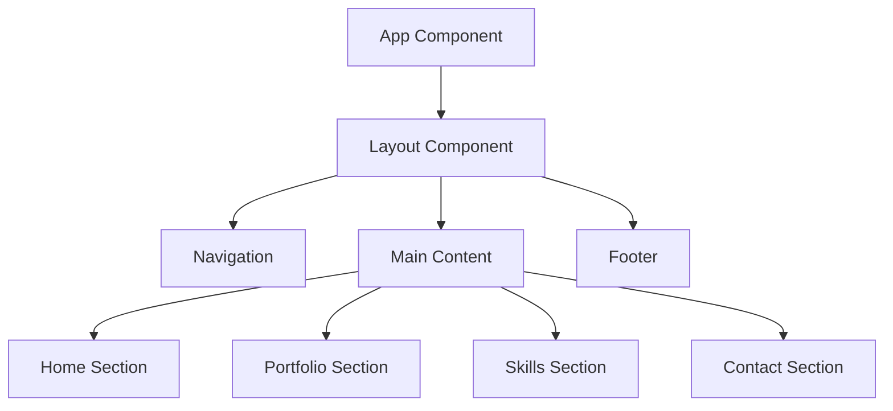
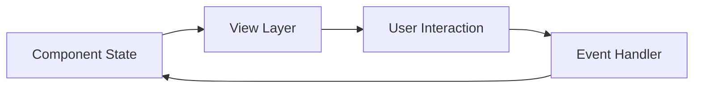

# System Patterns

## Architecture Overview

## Component Structure
1. **Layout Components**
   - Header/Navigation
   - Main Content Container
   - Footer
   - Responsive Container

2. **Feature Components**
   - Project Cards
   - Skill Indicators
   - Contact Form
   - Section Headers

3. **Shared Components**
   - Buttons
   - Icons
   - Loading States
   - Error Boundaries

## Design Patterns
1. **Component Patterns**
   - Container/Presenter Pattern
   - Higher-Order Components where needed
   - Composition over inheritance
   - React Hooks for state management

2. **State Management**
   - Local component state
   - React Context for theme/global states
   - Custom hooks for reusable logic

3. **Styling Patterns**
   - TailwindCSS utility-first approach
   - Responsive design breakpoints
   - CSS custom properties for theming
   - Component-specific styles

## Data Flow

## Performance Patterns
1. **Loading Optimization**
   - Code splitting
   - Lazy loading
   - Asset optimization
   - Caching strategies

2. **Rendering Optimization**
   - Memoization
   - Virtual DOM optimization
   - Efficient re-rendering
   - Performance monitoring

## Error Handling
1. **Error Boundaries**
   - Component-level error catching
   - Fallback UI components
   - Error reporting

2. **Form Validation**
   - Input validation
   - Error messaging
   - User feedback

## Testing Patterns
1. **Unit Tests**
   - Component testing
   - Hook testing
   - Utility function testing

2. **Integration Tests**
   - Component interaction
   - User flow testing
   - API integration testing 